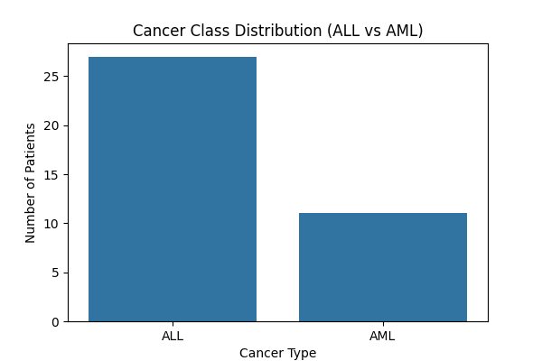
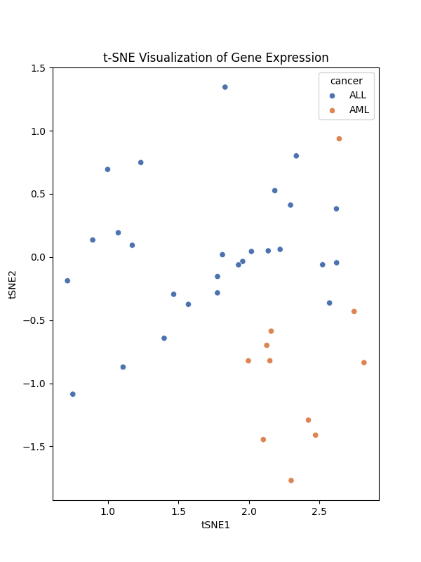
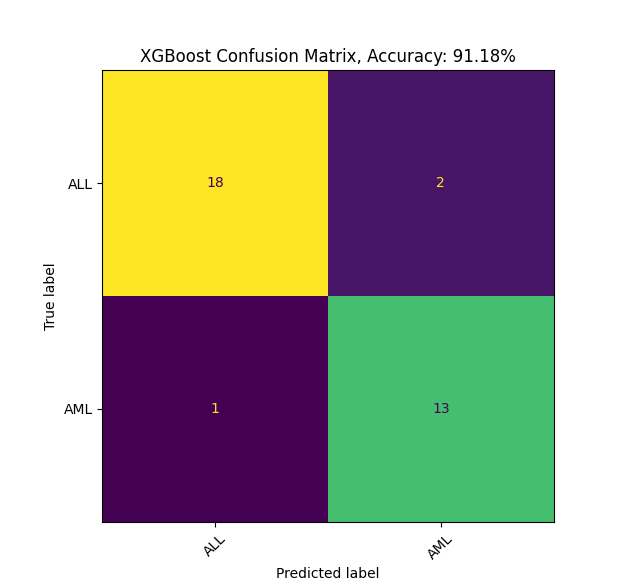

### ALL vs AML Classification Using Gene Expression Data

This project applies machine learning (Logistic Regression, Random Forest and XGBoost) to classify Acute Lymphoblastic Leukemia (ALL) and Acute Myeloid Leukemia (AML) patients based on gene expression profiles (DNA Microarrays). 
It's aimed to identify patterns in gene activity that distinguish between these two leukemia subtypes.

### Background

Leukemia diagnosis can benefit significantly from molecular-level analysis. Gene expression profiling provides a high-dimensional dataset, making it ideal for machine learning applications. 
This project utilizes publicly available microarray data (https://www.kaggle.com/datasets/crawford/gene-expression) to develop models capable of predicting the leukemia subtype with high accuracy, which could potentially support early diagnosis and treatment planning.

Data is obtained from Golub et al., 1999 (doi: 10.1126/science.286.5439.531).

## Technologies & Tools Used
- **Python 3.13**
- **Pandas**: Data manipulation and loading
- **Matplotlib & Seaborn**: Data visualization
- **scikit-learn**: Preprocessing, model training, evaluation
- **Logistic Regression, Random Forest, XGBoost**: Machine learning algorithms
- **t-SNE & PCA**: Dimensionality reduction and data visualization


## Usage
- The main script reads and processes the datasets, performs EDA, trains 3 models (Logistic Regression, Random Forest, XGBoost), and prints out classification metrics.
- It also saves important figures such as heatmaps, confusion matrices and PCA/t-SNE plots.

## Results

## Figures




### Classification Metrics (Test Set)
| Model               | Accuracy   | Cross-Validation Score |
|---------------------|------------|-------------------------|
| Logistic Regression | 0.82       | 0.95                    |
| Random Forest       | 0.74       | 0.90                    |
| __XGBoost__         | __0.91__   | __0.95__                |

### Confusion Matrix for XGBoost


## Project Structure
```
ALL-AML-Cancer/
├── data/
│   ├── data_set_ALL_AML_train.csv
│   ├── data_set_ALL_AML_test.csv
│   └── actual.csv
├── outputs/
│   ├── pca_plot.png
│   ├── tsne_plot.png
│   └── confusion_matrix_xgb.png
├── main.py
├── requirements.txt
└── README.md
```
- `data/`: Contains the training and testing datasets along with labels.
- `figures/`: Stores plots generated during EDA and model evaluation.
- `main.py`: Main script containing data loading, preprocessing, model training, and evaluation.
- `requirements.txt`: List of dependencies.
- `README.md`: Documentation of the project.

## Future Work
- Evaluate on external datasets for generalizability
- Investigate deep learning models (e.g., MLP or CNN on expression profiles)

---
